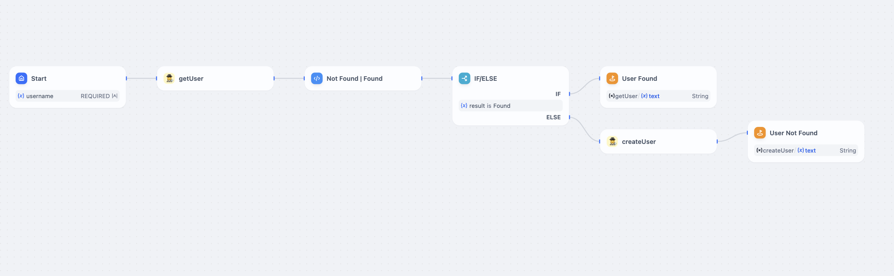

# Dify Tools Worker

## Description

This is an example of using Cloudflare Workers to create a simple API that store and retrieve data from D1 storage.

For basic usage, you can use the [Basic Template](./docs/basic.md).

```
git checkout v1.0
``` 

For more advanced usage, you can use the [Global Storage](./docs/global_store.md)

    

