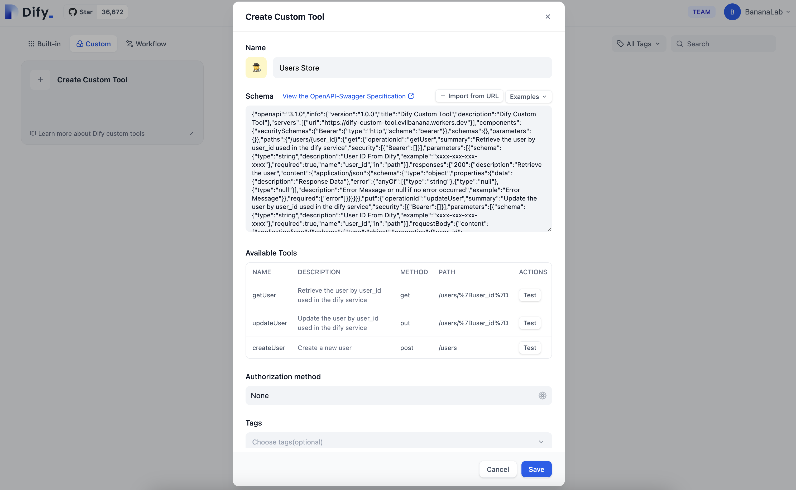
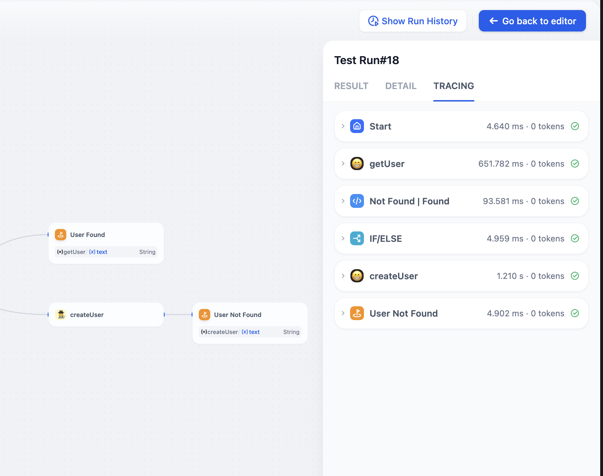
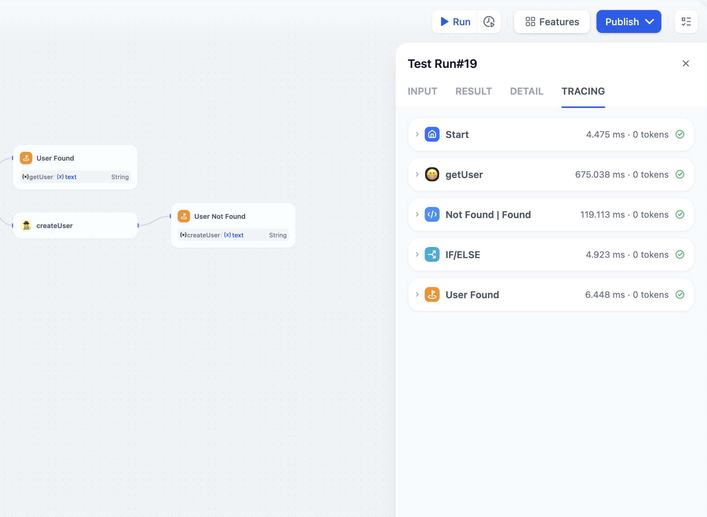
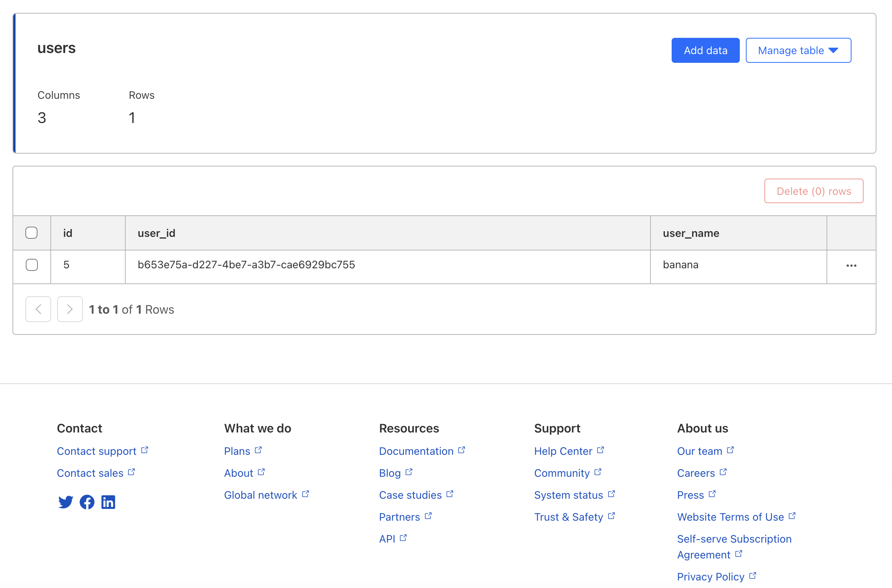

# Global Storage Guide

## Description

A CRUD example of using Cloudflare Workers to create a simple API that store and retrieve data from D1 storage.

## Quick Start

You will get a url like this: https://difytoolsworker.yourname.workers.dev

### Step 0
In Dify tools, you can create a new custom tool and use the `https://difytoolsworker.yourname.workers.dev/doc` as the endpoint.

### Step 1

Click import from URL you deployed from Cloudflare Workers.



### Step 2

Set the Authorization header with the token you set in the wrangler.toml file. Mine is `bananaiscool`.


### Step 3

Click Save and you are done.

## Step 4

You can now use the tool in Dify Workflows.

Not Found

  

Found   



In D1 Console



## Development
```
npm install
cp wrangler.toml.example wrangler.toml
npm run dev
```

### Database

#### Create Database

```
# Run this command to create a new database
npx wrangler d1 create <DATABASE_NAME>

# You will get things like this:

[[d1_databases]]
binding = "DB" # i.e. available in your Worker on env.DB
database_name = "dify-global-store"
database_id = "xxxx-xxx-xxx-xxx-xxxx"

# Paste the things above to the wrangler.toml file
```

#### Use Raw SQL

:( Do not do this

```
npx wrangler d1 execute <DATABASE_NAME> --local --file=./db/migrations/1.sql
npx wrangler d1 execute <DATABASE_NAME> --local --command="SELECT * FROM Users"
```
#### Use D1 Migrations
:) Do this

For readable purpose, we use D1 Migrations to manage database migrations.

```
npx wrangler d1 migrations create <DATABASE_NAME> users
npx wrangler d1 migrations apply <DATABASE_NAME> --local
npx wrangler d1 migrations list <DATABASE_NAME> --local
```

## Deploy

```
npm run deploy
```

## References

[Example Workflows](../assets/Test.yml)  
[Cloudflare Workers](https://developers.cloudflare.com/workers/)  
[Cloudflare D1](https://developers.cloudflare.com/workers/cli-wrangler/commands/d1)
